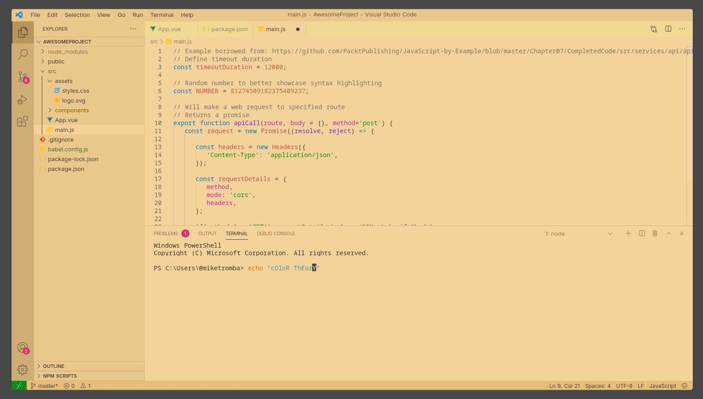

# Colorful Sepia Theme

A high saturation, colorful sepia theme for VSCode.

## Screenshots



## Installation

1. Open the extensions sidebar on Visual Studio Code
2. Search for `Colorful Sepia Theme`
3. Click Install
4. Click Reload to reload your editor
5. Select the Manage Cog (bottom left) > `Color Theme` ＞ `Theme`

## Tweaks & theming
If you want to play around with new colors, use the setting workbench.colorCustomizations to customize the currently selected theme. For example, you can add this snippet in your "settings.json" file:

```json
"workbench.colorCustomizations": {
    "tab.activeBackground": "#282c34",
    "activityBar.background": "#282c34",
    "sideBar.background": "#282c34",
}
```

or use the setting editor.tokenColorCustomizations

```json
   "editor.tokenColorCustomizations": {
    "[Theme]": {
      "textMateRules": [
        {
          "scope": [
            "source.python"
          ],
          "settings": {
            "foreground": "#e06c75"
          }
        }
      ]
    }
  }
```

### Italic
You could set this in your setting.json to make code be italic

```json
    "editor.tokenColorCustomizations": {
      "textMateRules": [
        {
          "scope": [
            // the following elements will be in italic
            "comment",
            "storage.modifier", // static keyword
            "storage.type.php", // typehints in methods keyword
            "keyword.other.new.php", // new
            "entity.other.attribute-name", // html attributes
            "fenced_code.block.language.markdown", // markdown language modifier
            "keyword", //import, export, return…
            "storage.modifier", //static keyword
            "storage.type", //class keyword
            "keyword.control",
            "constant.language",
            "entity.other.attribute-name",
            "entity.name.method",
            "keyword.control.import.ts",
            "keyword.control.import.tsx",
            "keyword.control.import.js",
            "keyword.control.flow.js",
            "keyword.control.from.js",
            "keyword.control.from.ts",
            "keyword.control.from.tsx"
          ],
          "settings": {
            "fontStyle": "italic"
          }
        },
        {
          "scope": [
            // the following elements will be displayed in bold
            "entity.name.type.class" // class names
          ],
          "settings": {
            "fontStyle": ""
          }
        },
        {
          "scope": [
            // the following elements will be displayed in bold and italic
            "entity.name.section.markdown" // markdown headlines
          ],
          "settings": {
            "fontStyle": "italic"
          }
        },
        {
          "scope": [
            // the following elements will be excluded from italics
            //   (VSCode has some defaults for italics)
            "invalid",
            "keyword.operator",
            "constant.numeric.css",
            "keyword.other.unit.px.css",
            "constant.numeric.decimal.js",
            "constant.numeric.json",
            "comment.block",
            "entity.other.attribute-name.class.css"
          ],
          "settings": {
            "fontStyle": ""
          }
        }
      ]
    },
```

## Change log
[CHANGELOG](./CHANGELOG.md)

## Issues & Suggestions

For any issues or suggestions, please use [GitHub issues](https://github.com/mateidragony/colorful-sepia-theme/issues).